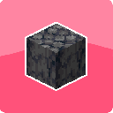

# [<](../README.md) Basalt Blocks



Two basalt blocks, not enough? Not worth the time to gather? This mod adds basalt blocks to further decorate your world, house, or nether castle!

## Mod Data

| Key         | Value          |
|-------------|----------------|
| supported   | `yes`          |
| version     | `1.0.2`        |
| mc_version  | `1.21`         |
| mod_id      | `basaltblocks` |
| client_side | `required`     |
| server_side | `required`     |

## LINKS
- [Modrinth](https://modrinth.com/mod/basalt-blocks)
- [Curseforge](https://curseforge.com/minecraft/mc-mods/basalt-blocks-fabric)
- [Wiki Page](https://github.com/legopitstop/Fabric/wiki/Basalt_Blocks)
- [License](https://legopitstop.weebly.com/license.html)
- [Bug Report](https://github.com/legopitstop/Fabric/issues)

## Maven
```gradle
dependencies {
    modImplementation "maven.modrinth:basalt-blocks:fabric-${project.basaltblocks_version}"
}
```
[More Information](https://docs.modrinth.com/docs/tutorials/maven/)
