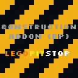

# [<](../README.md) Construction Blocks

Are you a builder? this mod has TONS of blocks. and adds some items that are vanilla-like. including more nuggets, sticks, and bookshelf in all wood types.

## Mod Data

| Key         | Value     |
|-------------|-----------|
| supported   | `yes`     |
| version     | `1.0.0`   |
| mc_version  | `1.20.1`  |
| mod_id      | `const`   |
| client_side | `required`|
| server_side | `required`|

## LINKS
- [Download](DOWNLOAD)
- [Wiki Page](https://github.com/legopitstop/Fabric/wiki/Construction_Blocks)
- [License](https://legopitstop.weebly.com/license.html)
- [Bug Report](https://github.com/legopitstop/Fabric/issues)