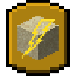

# [<](../README.md) Lightning Bolt Glass



Whenever lightning hits sand it turns into a glass

## Mod Data

| Key         | Value      |
|-------------|------------|
| supported   | `yes`      |
| version     | `1.2.0 `   |
| mc_version  | `1.21`     |
| client_side | `optional` |
| server_side | `required` |

## LINKS
- [Modrinth](https://modrinth.com/mod/lightning-bolt-glass)
- [Curseforge](https://curseforge.com/minecraft/mc-mods/lightning-bolt-glass)
- [Wiki Page](https://github.com/legopitstop/Fabric/wiki/Lightning_Bolt_Glass)
- [License](https://legopitstop.weebly.com/license.html)
- [Bug Report](https://github.com/legopitstop/Fabric/issues)

## Maven
```gradle
dependencies {
    modImplementation "maven.modrinth:lightning-bolt-glass:fabric-${project.lightningboltglass_version}"
}
```
[More Information](https://docs.modrinth.com/docs/tutorials/maven/)
