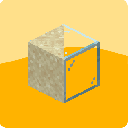

# [<](../README.md) Lightning Bolt Glass

Whenever lightning hits sand it turns into a glass

## Mod Data

| Key         | Value     |
|-------------|-----------|
| supported   | `yes`     |
| version     | `1.0.0 `  |
| mc_version  | `1.20.1`  |
| client_side | `optional`|
| server_side | `required`|

## LINKS
- [Download](https://legacy.curseforge.com/minecraft/mc-mods/lightning-bolt-glass)
- [Wiki Page](https://github.com/legopitstop/Fabric/wiki/Lightning_Bolt_Glass)
- [License](https://legopitstop.weebly.com/license.html)
- [Bug Report](https://github.com/legopitstop/Fabric/issues)