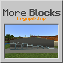

# [<](../README.md) More Blocks

This mod adds new varients of blocks! One block variant that you can find in the pack is "Layer" blocks, these blocks are like the Top Snow block that you can increase the height.

## Mod Data

| Key         | Value       |
|-------------|-------------|
| supported   | `yes`       |
| version     | `1.0.0`     |
| mc_version  | `1.20.1`    |
| mod_id      | `moreblocks`|
| client_side | `required`  |
| server_side | `required`  |

## LINKS
- [Download](DOWNLOAD)
- [Wiki Page](https://github.com/legopitstop/Fabric/wiki/More_Blocks)
- [License](https://legopitstop.weebly.com/license.html)
- [Bug Report](https://github.com/legopitstop/Fabric/issues)