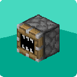

# [<](../README.md) Ultimate Block Breaker

This mod adds different tiered block breakers to break any blocks (besides bedrock). Perfect for automating cobblestone generators. Not to mention they are easy to use and upgrade.

## Mod Data

| Key         | Value     |
|-------------|-----------|
| supported   | `yes`     |
| version     | `1.0.0`   |
| mc_version  | `1.20.1`  |
| mod_id      | `breaker` |
| client_side | `required`|
| server_side | `required`|

## LINKS
- [Wiki Page](https://github.com/legopitstop/Fabric/wiki/Ultimate_Block_Breaker)
- [License](https://legopitstop.weebly.com/license.html)
- [Bug Report](https://github.com/legopitstop/Fabric/issues)